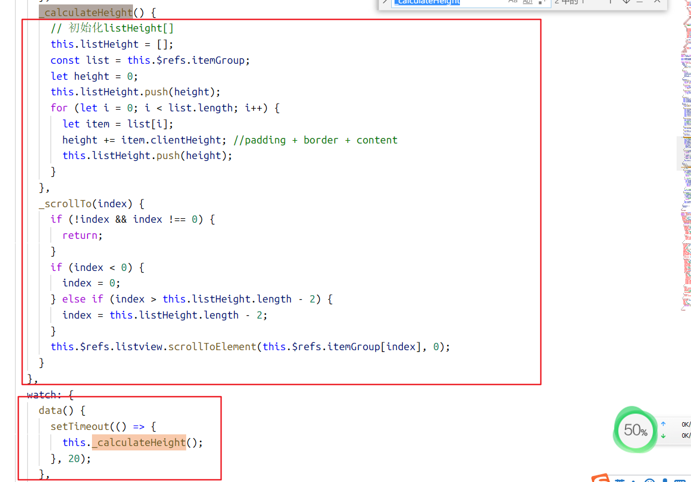
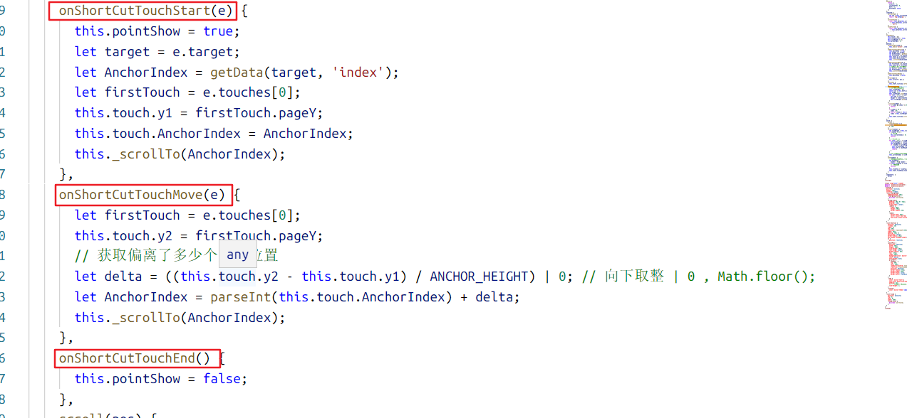
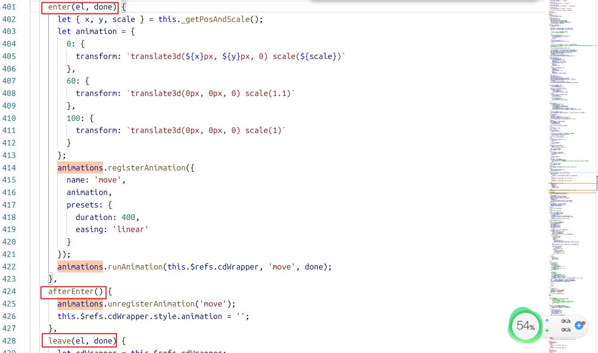
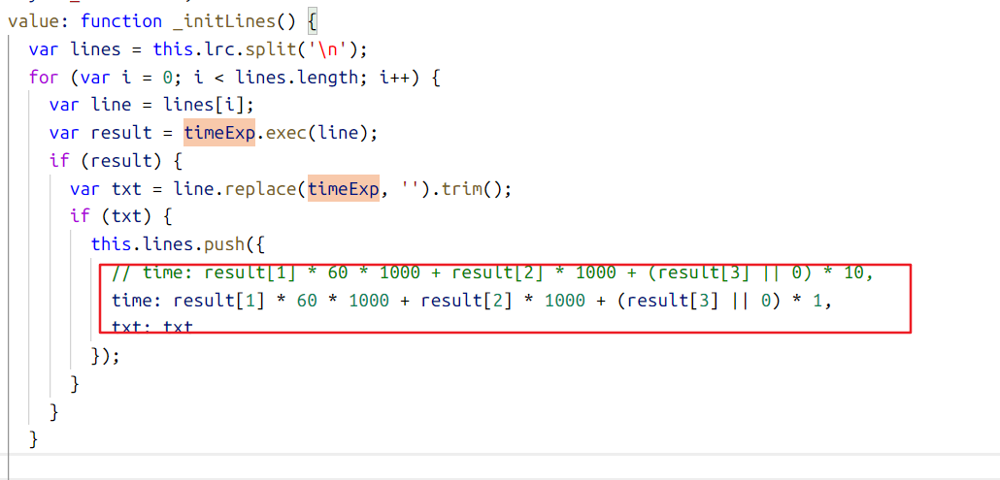

# 音乐播放器

> 经验总结


#### 目录结构

> ├─public
>
> │ └─img
>
> │   └─icons
>
> └─src
>
> │ └─api		   接口目录（每个模块对应的数据接口文件）
>
> │ └─assets		资源目录（公用的css, js, img）
>
> │ └─components	组件级目录
>
> │ └─router		vue-router目录
>
> │ └─store		 vuex目录
>
> │ └─views		 页面级目录


#### 感想

> 目录结构分层次，结构清晰，方便维护


#### 生成目录树方法

```shell
# windows

tree /? #查看使用方法
 # /F   显示每个文件夹中文件的名称。
 # /A   使用 ASCII 字符，而不使用扩展字符。
tree > tree.txt # 注意node_modules目录
```


# 经验值

`main.js`

```js
import Vue from 'vue';
import App from './App.vue';
import './registerServiceWorker';
import fastclick from 'fastclick';
import router from './router';
import store from './store';
// 引入图片懒加载
import VueLazyload from 'vue-lazyload';

// 解决移动端点击300ms延迟
fastclick.attach(document.body);

// or with options
Vue.use(VueLazyload, {
  loading: require('assets/images/lazy_Loading.png')
});

import 'assets/css/index.scss';

Vue.config.productionTip = false;

new Vue({
  router,
  store,
  render: h => h(App)
}).$mount('#app');

```


#### 全局样式

在 `main.js` 中引入样式为全局样式

```js
import 'assets/css/index.scss'
```


#### 图片懒加载

使用了图片懒加载，也是首次接触到`图片懒加载`

````js
// 引入图片懒加载
import VueLazyload from 'vue-lazyload';

// or with options
Vue.use(VueLazyload, {
  // 懒加载默认显示的图片
  loading: require('assets/images/lazy_Loading.png')
});
````


#### fastclick

> 解决移动端点击300ms延迟

```js
import fastclick from 'fastclick';
// 解决移动端点击300ms延迟
fastclick.attach(document.body);
```


------


#### 项目`jsonp`

> https://github.com/webmodules/jsonp	此次项目没有使用到jsonp方法


#### 代码格式化

`.prettierrc.json `

```js
{
  // 使用单引号，并且 “‘’” 合法存在
  "singleQuote": true,
  // 分号
  "semi": true
}
```


#### 配置目录别名

在 `vue.config.js` 中 填写相关配置

```js
// configureWebpack最高级别的配置项
configureWebpack: {
    resolve: {
        alias: {
            components: '@/components',
                views: '@/views',
                assets: '@/assets'    
        }
    }
}
```


#### 异步加载路由

```js
// 参考例子
{
    path: '/about',
    name: 'About',
    component: () => import('../views/About.vue')
}
```


-----

#### vuex 结构化

> 项目没有使用到vuex模块化管理

1. 初始化 `Vuex`
2. 对 `Vuex` 进行 分文件管理
3. 对 `Vuex` 更加了解


##### 目录树

> ├─store
> │  ├─state.js
> │  ├─mutations.js
> │  ├─mutation-type.js
> │  ├─getters.js
> │  ├─actions.js
> │  └─index.js


当需要使用 vuex 维护的时候：步骤

> state -> getters -> mutation-type -> mutations -> [actions]


##### 感想

> mutation-type  定义常量对 mutation 进行标准化
>
> getters	和 computed 计算属性作用类型
>
> mutation	属于同步执行
>
> actions	属于异步执行（作用：进行异步操作，对mutation进行封装）


------

#### vue-transition

> 对元素的显示和隐藏进行动画显示


**重点关注** （可使用class或者钩子函数）

`name-enter-active, name-leave-active` : 这部分适合负责过渡效果`transition`

`name-enter, name-leave-to` : 这部分适合负责动画的效果 ：位移值，方向值，缩放值，透明度等等


enter ：	表示在元素显示后，元素的初始状态 变化成元素拥有的 当前状态

leave-to：	表示元素还未隐藏，元素的当前状态 变化成 最终的状态


enter 和 leave-to 这两个类有着相辅相成的作用

##### ps例子


```html
<transition name="slide">
          <router-view></router-view>
</transition>
```

```scss
.slide-enter-active,
.slide-leave-active {
  transition: all 0.3s;
}
.slide-enter,
.slide-leave-to {
  transform: translate3d(100%, 0, 0);
}
```


#### nextTick, mixin


**nextTick**

> 在下次 DOM 更新循环结束之后执行延迟回调。在修改数据之后立即使用这个方法，获取更新后的 DOM。


-----


**mixin**

> mixin 和 vue实例类似


如果 `2+` 个的组件具有相同的部分，则可以使用 `mixin` 来完成这相同的部分，在 `vue实例` 中使用这个mixin即可


#### 节流处理

> 在搜索歌曲的时候，监听`input`的`change`事件，但不可能每次改变都进行数据的请求，这样子会非常耗费用户的流量，同时也会带来体验上的卡顿

所以在监听 `input` 的 `change` 事件的同时，对发起请求进行延迟处理，并判断在该延迟时间段内是否再次出发 `change` 事件


# 组件

> 包含一些非页面级别的组件

#### 目录结构

> ├─components
> │  ├─AddSong
> │  ├─Confirm
> │  ├─ListView
> │  ├─Loading
> │  ├─MusicList
> │  ├─MyHeader
> │  ├─NoResult
> │  ├─Player
> │  ├─PlayList
> │  ├─ProgressBar
> │  ├─ProgressCircle
> │  ├─Scroll
> │  ├─SearchBox
> │  ├─SearchList
> │  ├─Slider
> │  ├─SongList
> │  ├─Suggest
> │  ├─Switches
> │  ├─Tab
> │  ├─Toast
> │  └─TopTip


#### 感想

> 负责渲染的组件，不进行逻辑上的处理，只负责对界面的渲染。而需要逻辑处理的事件，使用$emit派发到父组件。
>
> 父组件或者更上一级组件进行统一处理


# 类

#### <u>Class song</u>

```js
/*
  function constructor 构造函数
    @param String | Number id 歌曲id
    @param String | Number mid 专辑id
    @param String singer 歌手名字[可能是多个, 用/划分 ==> 周杰伦/蔡依林]
    @param String name  歌曲名字
    @param String album 专辑名字
    @param String | Number duration 播放时长
    @param String image 歌曲图片地址
    @param String url 歌曲播放地址
  */
class Song {
    constructor({ id, mid, singer, name, album, duration, image, url }) {
        this.id = id;
        this.mid = mid;
        this.singer = singer;
        this.name = name;
        this.album = album;
        this.duration = duration;
        this.image = image;
        this.url = url;
      }
}
```


#### Class Singer

```js
 /*
  function constructor 构造函数
    @param String | Number id 歌手id
    @param String name 歌手名字
    @param String avatar 歌手头像
  */
  constructor({ id, name, avatar }) {
    this.id = id;
    this.name = name;
    this.avatar = avatar + '?param=300y300';
  }
```


# css

#### 一端固定宽度， 一端自适应

https://www.cnblogs.com/rxbook/p/10661709.html

#### 使用定位设置元素内容大小

```scss
.ps {
    position: absolute;
    width: 100%;
    top: 60px;	// top栏占了高度60px
    bottom: 50px;	// tab栏占了50px
}

// 那么这里ps的内容高度 为整个屏幕大小 - 60px - 50px;
```


#### 使用字体图标

> 使用阿里巴巴iconfront	https://www.iconfont.cn/

1. 下载字体图标文件
2. 使用后缀：`eot` `svg` `ttf` `woff` 四个文件
3. 引入
4. 对元素添加对应图标的 `class` 名字


# 项目核心知识点


#### 排行榜同步滑动处理


1. 监听快速拖动里面的每一个元素的 `touch` 三事件（ `touchstart`， `touchmove`， `touchend` ）

2. 已经有数据并且已经渲染完成后，对不同分类的每一块区域范围进行计算高度

   

3. `touchstart` 事件对一些 `控制变量` 进行初始化

4. `touchmove` 事件对位置进行监听，做出相应变化

5. `touchend`  事件恢复相应的变量为初始值

6. 具体实现看源代码

   


#### Tab栏动态滑动

原理：

1. 不使用 `border` 属性
2. 另写一个滑动条，然后使用钩子函数

具体实现参考源代码 `Components` <u>--></u> `Tab.vue`


#### 音频缓冲条

监听 `audio标签` <u>**timeupdate**</u> 事件

```html
<audio
      ref="audio"
      :src="currentSong.url"
      @canplay="ready"
      @error="error"
      @timeupdate="updateTime"
      @ended="playEnd"
></audio>
```


```js

updateTime(e) {
      if (this.bufferPercent < 100) {
        // 获取buffered对象, 使用e.target.buffered.length
        // 而不使用 const timeRanges = e.target.buffered; 
        // 原因是这样子有bug
        if (e.target.buffered.length !== 0) {
          const timeRanges = e.target.buffered;
          // 获取已缓冲的时间
          const rangVal = timeRanges.end(timeRanges.length - 1);
          this.bufferPercent = parseInt((rangVal / e.target.duration) * 100);
        }
      }
      if (!this.songReady) return;
      this.currentTime = e.target.currentTime; // e.target.currentTime是一个可读写的属性
    },
```


#### JS编写动画

> 使用 `create-keyframe-animation`

此处配合了钩子函数，具体用法参考文档

https://www.npmjs.com/package/create-keyframe-animation




#### 歌词时间错误

> 定位到lyric-parser插件的文件根目录

