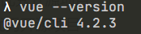

# 基于 vue 的在线音乐播放器

#### 介绍

基于最新的 vue 和 vue cli 进行开发一个音乐播放器，数据源来自 qq 音乐

#### 软件架构


#### 安装教程

1.  xxxx
2.  xxxx
3.  xxxx

#### 使用说明

1.  xxxx
2.  xxxx
3.  xxxx

#### 参与贡献

1.  Fork 本仓库
2.  新建 Feat_xxx 分支
3.  提交代码
4.  新建 Pull Request

#### 码云特技

1.  使用 Readme_XXX.md 来支持不同的语言，例如 Readme_en.md, Readme_zh.md
2.  码云官方博客 [blog.gitee.com](https://blog.gitee.com)
3.  你可以 [https://gitee.com/explore](https://gitee.com/explore) 这个地址来了解码云上的优秀开源项目
4.  [GVP](https://gitee.com/gvp) 全称是码云最有价值开源项目，是码云综合评定出的优秀开源项目
5.  码云官方提供的使用手册 [https://gitee.com/help](https://gitee.com/help)
6.  码云封面人物是一档用来展示码云会员风采的栏目 [https://gitee.com/gitee-stars/](https://gitee.com/gitee-stars/)


# 版本信息

使用`vue-cli@4.x`




# 前端工具


#### Babel


#### Webpack


#### Eslint


#### Prettier


# 音乐播放器


#### 目录结构

> ├─public
>
> │ └─img
>
> │   └─icons
>
> └─src
>
>   ├─assets		资源目录（公用的css, js, img）
>
>   ├─components	组件级目录
>
>   ├─router		vue-router目录
>
>   ├─store		 vuex目录
>
>   └─views		 页面级目录

生成目录树

```shell
# windows

tree /? #查看使用方法
 # /F   显示每个文件夹中文件的名称。
 # /A   使用 ASCII 字符，而不使用扩展字符。
tree > tree.txt # 注意node_modules目录
```


#### 项目`jsonp`

> https://github.com/webmodules/jsonp


#### 代码格式化

`.prettierrc.json `

```js
{
  // 使用单引号，并且 “‘’” 合法存在
  "singleQuote": true,
  // 分号
  "semi": true
}
```


#### 配置目录别名

在 `vue.config.js` 中 填写相关配置

```js
// configureWebpack最高级别的配置项
configureWebpack: {
    resolve: {
        alias: {
            components: '@/components',
                views: '@/views',
                assets: '@/assets'    
        }
    }
}
```


#### 异步加载路由

```js
// 参考例子
{
    path: '/about',
    name: 'About',
    component: () => import('../views/About.vue')
}
```


# 经验值


基础 `main.js`

```js
import Vue from 'vue';
import App from './App.vue';
import './registerServiceWorker';
import router from './router';
import store from './store';

Vue.config.productionTip = false;

new Vue({
  router,
  store,
  render: h => h(App)
}).$mount('#app');
```


在 `main.js` 中引入样式为全局样式

```js
import 'assets/css/index.scss'
```


# 组件


#### Slider

props: 

- <u>loop</u>  无缝 [ Boolean ]
- <u>autoPlay</u>  自动播放 [ Boolean ]
- <u>interval</u>  间隔时间 [ Number ]	

`slot`里面的内容单纯的只要渲染就行了。

**<u>父容器</u>** 和更高的 **<u>父容器</u>** 交给`scroll`组件


#### Scroll

props:

- probetype: 分发滚动事件类型[ Number ]
- click: 点击 [ Boolean ]
- data: 数据( 刷新容器的大小 ) [ Array ]


获取歌手详情信息 ( <u>id</u>, <u>mid</u>, <u>singer</u>, <u>name</u>, <u>album</u>, <u>duration</u>, <u>image</u>, <u>url</u> )

**获取歌手单曲：**  `/artists?id=6452`

**<u>Class song</u>**

```js
/*
  function constructor 构造函数
    @param id String | Number 歌曲id
    @param mid String | Number 不清楚
    @param singer String 歌手名字[可能是多个, 用/划分 ==> 周杰伦/蔡依林]
    @param name String  歌曲名字
    @param album String 专辑名字
    @param duration String | Number 播放时长
    @param image String 歌曲图片地址
    @param url String 歌曲播放地址
  */
class Song {
    constructor({ id, mid, singer, name, album, duration, image, url }) {
        this.id = id;
        this.mid = mid;
        this.singer = singer;
        this.name = name;
        this.album = album;
        this.duration = duration;
        this.image = image;
        this.url = url;
      }
}
```


**获取音乐url：**`/song/url`

**调用例子 :** `/song/url?id=33894312` `/song/url?id=405998841,33894312`


select --> actions  {

​	设置播放列表

​	设置序列列表

​	设置播放索引 --> 当前歌曲会发生变化 --> 

​	设置展开播放 

} -->  watch --> {

​	currentSong() {

​		获取音乐url和音乐lyric

​		进行播放

​	}

}


一端固定宽度， 一端自适应

https://www.cnblogs.com/rxbook/p/10661709.html


歌词时间错乱问题根本

