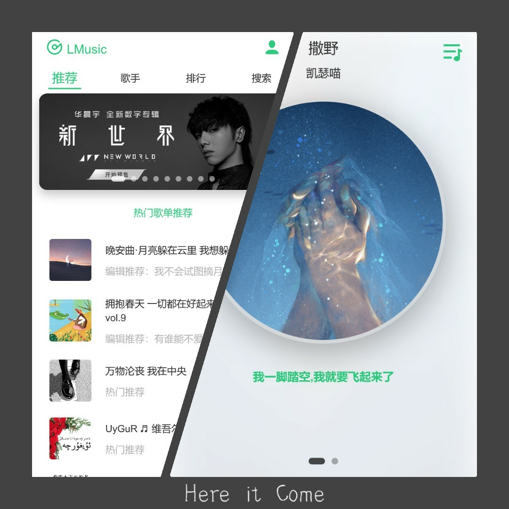
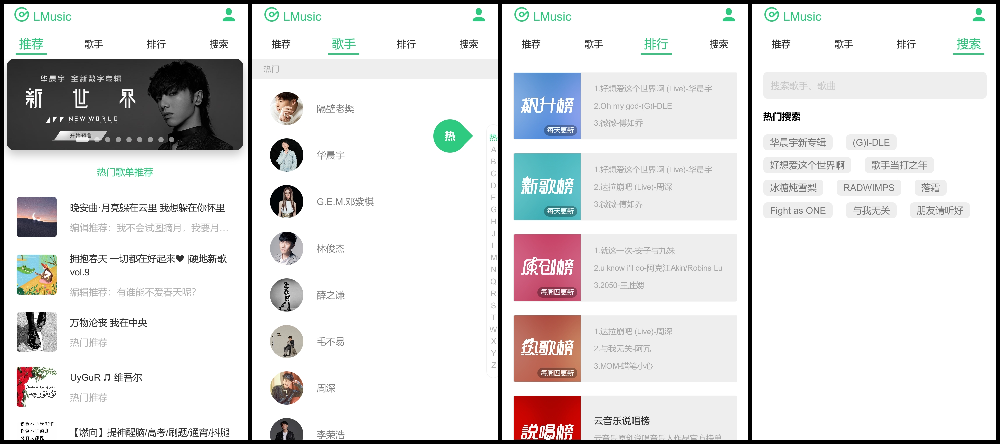
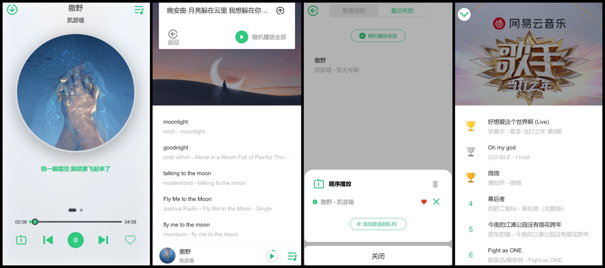
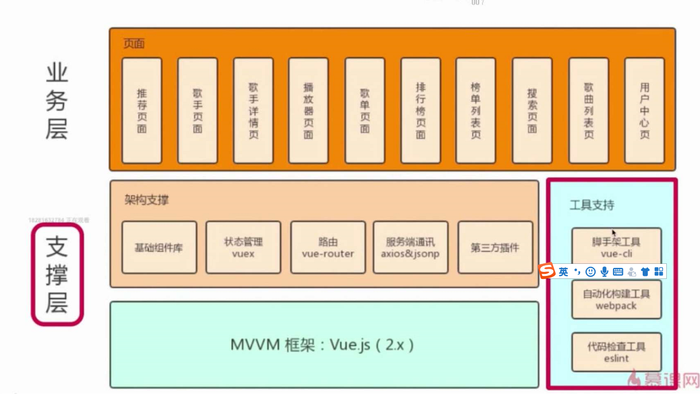

# 基于 vue 在线音乐播放器

#### 效果图（部分）

#### 介绍

基于当前最新 `Vue` 版本， 采用`vue-cli`脚手架搭建项目，开发的音乐播放器，数据源来自网易云音乐接口。

#### 软件架构

#### 安装教程

1.  克隆项目 **|** 下载项目
2.  进入项目根目录 **&&** 执行 `npm install`
3.  执行 `npm run serve`

#### 使用说明

1.  该项目为个人实战项目
2.  不可用于商用，售卖等等
3.  违反并被发现者，会告其侵权

#### 参与贡献

1. 感谢 `Binaryify` 提供的接口支持

   > https://github.com/Binaryify/NeteaseCloudMusicApi

2. 感谢慕课上的指导老师

3. 感谢自己一直坚持

   

# 版本信息

> 项目没有使用第三方ui库和框架，纯粹为人为设计和手写

Vue 脚手架( vue-cli ) ：`4.x`

Vue 版本：`^2.6.11`

Vuex 版本：`^3.1.2`

Vue-Router 版本：`^3.1.5`

#### 使用第三方插件

- `BetterScroll@2.0` 

  > 采用原生js编写，原生滚动插件，具有原生app效果

- `axios`

  > 用于浏览器和node.js的基于Promise的HTTP客户端

- `fastclick`

  > 解决移动端上点击300ms延迟

- `lyric-parser`

  > 歌词解析插件， 作者同于BetterScroll

- `good-storage`

  > 对SessionStorage，LocalStorage的封装，作者同于BetterScroll

- `create-keyframe-animation`

  > 使用js编写动画，并应用于元素上
